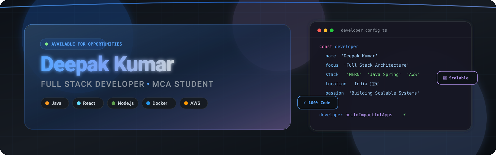
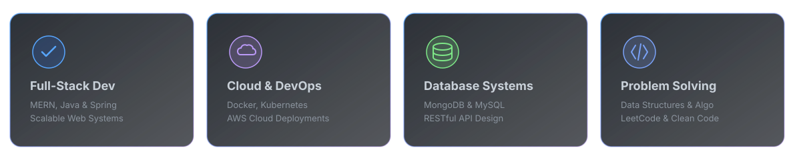

<div align="center">

  <!-- Hero Banner -->
  <a href="https://github.com/deepak-kumar9308">
    
  </a>

  <br/><br/>

  <!-- Profile Visitor Counter & Badges -->
  <p align="center">
    <a href="https://github.com/deepak-kumar9308">
      
    </a>
    <a href="https://github.com/deepak-kumar9308?tab=repositories">
      
    </a>
    <a href="https://komarev.com/ghpvc/?username=deepak-kumar9308&color=7AA2F7&style=for-the-badge&label=PROFILE+VIEWS">
      
    </a>
  </p>

  <!-- Dynamic Typing SVG Header -->
  <a href="https://readme-typing-svg.demolab.com">
    
  </a>

  <br/><br/>

  <!-- Social Connection Badges -->
  <p align="center">
    <a href="https://www.linkedin.com/in/deepak-kumar-58273a264" target="_blank">
      
    </a>
    &nbsp;
    <a href="https://leetcode.com/u/deepak_kr_93/" target="_blank">
      
    </a>
    &nbsp;
    <a href="mailto:deepakkr93087@gmail.com">
      
    </a>
    &nbsp;
    <a href="https://github.com/deepak-kumar9308" target="_blank">
      
    </a>
  </p>

</div>

<br/>

<!-- Section Divider -->
<p align="center">
  
</p>

---

## 👨‍💻 About Me

```javascript
const deepakKumar = {
  code: ["Java", "JavaScript", "Python", "C++"],
  technologies: {
    frontend: ["React.js", "Tailwind CSS", "Bootstrap", "HTML5/CSS3"],
    backend: ["Node.js", "Express.js", "Java Spring", "REST APIs"],
    database: ["MongoDB", "MySQL", "JDBC"],
    devops: ["Docker", "Kubernetes", "AWS", "Git", "GitHub Actions"]
  },
  currentFocus: "Mastering Distributed Systems & Cloud Microservices 🚀",
  education: "Master of Computer Applications (MCA) 🎓",
  challenge: "Solving complex Algorithmic Data Structures on LeetCode 🧩"
};
```

- 🎓 **Education:** Pursuing **MCA (Master of Computer Applications)**.
- 🔭 **Current Work:** Building **MediPulse**, an enterprise-grade Doctor Appointment System combining MERN & Java Spring.
- 🌱 **Learning:** Deep diving into Microservices Architecture, Kubernetes Clusters, and Cloud-Native AWS solutions.
- 💼 **Goals:** Seeking Full-Time Software Engineering & Full-Stack Developer Roles.
- 📫 **Contact:** Drop a mail at **[deepakkr93087@gmail.com](mailto:deepakkr93087@gmail.com)**.

<br/>

<!-- Feature Icons Specialty Grid -->
<p align="center">
  
</p>

---

## 🛠️ Tech Stack & Skillset

<div align="center">

  ### 🌐 Frontend Development
  <p align="center">
    <a href="https://skillicons.dev">
      
    </a>
  </p>

  ### ⚙️ Backend & Frameworks
  <p align="center">
    <a href="https://skillicons.dev">
      
    </a>
  </p>

  ### 🗄️ Databases & Storage
  <p align="center">
    <a href="https://skillicons.dev">
      
    </a>
  </p>

  ### ☁️ Cloud, DevOps & Tools
  <p align="center">
    <a href="https://skillicons.dev">
      
    </a>
  </p>

</div>

---

## 🚀 Featured Projects

<table>
  <tr>
    <td width="50%" stroke="#1F6FEB">
      <h3 align="center"><b>🏥 01. MediPulse — Doctor Appointment System</b></h3>
      <p align="center">
        
        
      </p>
      <p>A high-performance healthcare scheduling platform designed to streamline doctor appointment booking, patient record management, automated email reminders, and real-time schedule consultation.</p>
      <ul>
        <li><b>Tech Stack:</b> React.js, Node.js, Express.js, Java, Spring Boot, MySQL, MongoDB, Docker</li>
        <li><b>Features:</b> JWT Authentication, Role-based Dashboards (Admin, Doctor, Patient), Schedule Calendar</li>
      </ul>
      <p align="center">
        <a href="https://github.com/deepak-kumar9308/MediPulse">
          
        </a>
      </p>
    </td>
    <td width="50%">
      <h3 align="center"><b>🎵 02. Spotify Clone</b></h3>
      <p align="center">
        
        
      </p>
      <p>A feature-rich web music player inspired by Spotify, featuring real-time audio playback control, dynamic playlist creation, track streaming, responsive UI, and custom audio visualizers.</p>
      <ul>
        <li><b>Tech Stack:</b> React.js, Node.js, Express, Web Audio API, Tailwind CSS</li>
        <li><b>Features:</b> Audio player, volume controls, search system, responsive mobile layout</li>
      </ul>
      <p align="center">
        <a href="https://github.com/deepak-kumar9308/Spotify-Clone">
          
        </a>
      </p>
    </td>
  </tr>
  <tr>
    <td width="50%">
      <h3 align="center"><b>💼 03. Personal Portfolio Website</b></h3>
      <p align="center">
        
        
      </p>
      <p>An Apple-inspired interactive developer portfolio engineered with modern Glassmorphism UI, smooth scroll animations, dynamic theme engine, and detailed project showcases.</p>
      <ul>
        <li><b>Tech Stack:</b> React.js, HTML5, CSS3, JavaScript (ES6+), Framer Motion</li>
        <li><b>Features:</b> Responsive design, interactive project filters, contact form integration</li>
      </ul>
      <p align="center">
        <a href="https://github.com/deepak-kumar9308/Portfolio-Website">
          
        </a>
      </p>
    </td>
    <td width="50%">
      <h3 align="center"><b>🎓 04. Student Management System</b></h3>
      <p align="center">
        
        
      </p>
      <p>A robust backend desktop enterprise application built with Core Java and JDBC for managing student records, grade tracking, course enrollment, and automated reporting.</p>
      <ul>
        <li><b>Tech Stack:</b> Java, JDBC, MySQL, OOP Architecture</li>
        <li><b>Features:</b> CRUD operations, relational schema, SQL transaction safety, reporting</li>
      </ul>
      <p align="center">
        <a href="https://github.com/deepak-kumar9308/Student-Management-System">
          
        </a>
      </p>
    </td>
  </tr>
</table>

---

## 📊 GitHub Analytics & Statistics

<div align="center">
  <table border="0">
    <tr>
      <td width="50%" align="center">
        
      </td>
      <td width="50%" align="center">
        
      </td>
    </tr>
    <tr>
      <td width="50%" align="center">
        
      </td>
      <td width="50%" align="center">
        
      </td>
    </tr>
  </table>
</div>

<br/>

## 🐍 Contribution Graph & Activity

<div align="center">

  <p align="center">
    
  </p>

</div>

---

## 🏅 Certifications & Achievements

- 📜 **Full Stack Web Development Certification** — Expert proficiency in MERN Stack & Java Enterprise development.
- 🧩 **LeetCode DSA Practitioner** — Solved multi-category Data Structures and Algorithm challenges.
- 🎓 **Academic Excellence in MCA** — Specialized in Database Management, Operating Systems, and Object-Oriented Software Engineering.
- 🐳 **Cloud & Containerization Training** — Practical experience with Docker container workflows and AWS deployment setups.

---

<div align="center">

  ### 💭 Developer Quote

  > *"Simplicity is prerequisite for reliability."*  
  > — **Edske W. Dijkstra**

  <br/>

  <p align="center">
    ⚡ <i>Designed with precision, Apple-inspired glassmorphism, and Tokyo Night palette.</i> ⚡
  </p>

  <br/>

  <a href="#top">
    
  </a>

  <br/><br/>
  
  <sub>© 2026 <b>Deepak Kumar</b>. All rights reserved.</sub>

</div>
